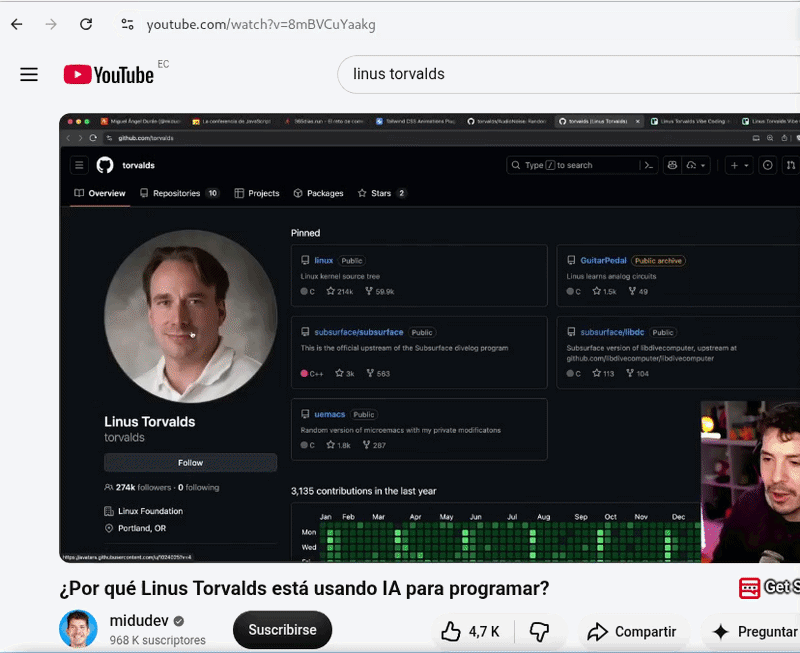

# YouTube Subtitle Downloader

A complete desktop application written in **Python 3 + PyQt6** that lets you
download subtitles from YouTube using [**yt-dlp**](https://github.com/yt-dlp/yt-dlp),
aimed mainly at Linux (Debian, Ubuntu, MX Linux and derivatives).

You do not need to know the command line: paste a video URL, inspect the
available subtitles, select one or more languages and download them.

> The primary language of the application is **English**. Translations (via Qt
> Linguist) are bundled for Spanish, German, French, Japanese, Korean,
> Brazilian Portuguese, Russian and Chinese, selectable in
> Settings → General → Language (the app follows the system language by default).

## Features

- Fetch video info and thumbnails without freezing the GUI (background threads).
- List **manual** and **automatic** subtitles in separate tabs with a search box.
- Distinguish the original language (`es-orig`, `en-orig`, ...) with a badge.
- Select one, several or all languages; filters for manual/automatic only.
- Download in **SRT**, **VTT**, **TTML**, **JSON3** or the **original** format.
- Create a **clean TXT file** that removes the incremental repetitions of
  YouTube automatic captions (three layouts: continuous, paragraphs, one line
  per subtitle).
- Download **multiple languages in one operation** with per-track progress.
- Subtitle **preview** window with search, copy and save.
- Optional **history** of processed videos (can be disabled).
- Optional **cookies** support (from browser or `cookies.txt`) for restricted videos.
- Drag & drop URLs, paste from clipboard, playlist detection (MVP).
- System theme aware, keyboard shortcuts, tooltips, optional CLI.
- System theme **icons** on buttons and menus (`QIcon.fromTheme`, falls back
  to text when the active theme lacks an icon), and a **custom application
  logo** (`resources/icons/youtube-subtitle-downloader.svg`) used in the
  window and system tray. The same icon is installed to the user icon theme
  at `~/.local/share/icons/hicolor/scalable/apps/`.
- Optional **desktop notification** when a download finishes while the window
  is not active (Settings → General; uses `notify-send` with a system-tray
  fallback — no heavy dependencies).
- No telemetry; everything runs locally.

## Requirements

- Python 3.9+ (tested on 3.13)
- PyQt6
- FFmpeg (optional; only used when the chosen format needs conversion)
- yt-dlp (For this tutorial, yt-dlp from the MX-Linux repositories was used.)

### Dependencies from the repository

For deb packages distros like: Ubuntu, Linux Mint, Debian, MX Linux, antiX, etc, etc

```bash
sudo apt install python3 python3-pyqt6 ffmpeg
```

## Installation

Clone or download this repository:

[https://github.com/wachin/youtube-subtitle-downloader](https://github.com/wachin/youtube-subtitle-downloader)

Open a terminal in the repository folder

## Run the application

```bash
python3 run.py
```



(also work with this command `PYTHONPATH=src python3 -m youtube_subtitle_downloader`).

## Usage

1. Paste a YouTube URL (or drag & drop it onto the window).
2. Press **Analyze** (or Enter).
3. Check the languages you want — the tabs filter between *All*,
   *Subtitles* (manual) and *Automatic*.
4. Choose the format, the TXT option, the destination folder and the file
   name template.
5. Press **Download selected**.

Shortcuts: `Ctrl+L` URL · `Ctrl+F` search · `Ctrl+D` download · `Ctrl+,`
settings · `Ctrl+Q` quit.

### Command line

A small CLI is included (the GUI remains the priority):

```bash
youtube-subtitle-downloader-cli URL --lang es-orig --format srt --txt
```

## Formats

- **SRT** / **VTT** / **TTML** / **JSON3**: generated from the best source
  format available (the app converts between formats when needed).
- **Original**: the subtitle data exactly as provided by yt-dlp.

## Automatic captions

Many videos have no manual subtitles while still providing automatic
captions (yt-dlp may even report `has no subtitles` in that case). This
application always uses the structured `automatic_captions` data, so those
tracks are shown and downloadable normally.

## Clean text

The *clean TXT* option produces only what is spoken: no sequence numbers, no
timestamps, no tags, no metadata. The incremental repetitions YouTube
automatic captions introduce are removed conservatively (overlapping cues are
merged only when they overlap in time), so legitimate repetitions are kept.

## Privacy

- URLs are sent only to the servers required by YouTube/yt-dlp to fetch content.
- Files are saved locally; there is **no telemetry**.
- The optional history (dates, titles, URLs) is stored locally in the user
  data folder and can be disabled in *Settings → Privacy*.

## Cookies

Some videos require authentication. You can enable cookies via
*Tools → Settings → YouTube*:

- **Cookies from browser** — uses yt-dlp's `--cookies-from-browser`.
- **Cookies file** — a Netscape-format `cookies.txt`.

Cookie contents are never read, stored or logged by this application.

## Troubleshooting

- **“yt-dlp was not found”** — install yt-dlp with your package manager or
  follow the [official instructions](https://github.com/yt-dlp/yt-dlp#installation).
- **Restricted videos** — enable cookies (see above).
- **Missing formats** — some tracks only offer a subset of formats; the app
  converts from the best available source when possible.
- Technical details are written to the rotating log under the user data
  folder (`~/.local/share/youtube-subtitle-downloader/logs/app.log`).

## Development

> **Optional — regular users do not need pip.** On Debian-family distributions
> (Ubuntu, Linux Mint, Debian, MX Linux, antiX, …) the dependencies are
> available in the repositories: `sudo apt install python3 python3-pyqt6
> yt-dlp ffmpeg` and then `python3 run.py` is enough.

Pip is only useful for **developers** or for systems where the dependencies
are not available in the repositories (or are too old), for example:

- your distribution does not package PyQt6 and/or yt-dlp;
- you want an isolated environment that does not modify system packages;
- you want a newer yt-dlp than the repository version.

To set up an isolated virtual environment (recommended for development):

```bash
# Debian/Ubuntu/MX users may need this first:
# sudo apt install python3-venv
python3 -m venv .venv
source .venv/bin/activate
pip install -e ".[dev]"   # runtime deps + dev tools (pytest, ruff, black, mypy)
python -m pytest          # run the test suite
```

After that you can also launch the app from the virtual environment with
`youtube-subtitle-downloader` or `python run.py`. To install only the runtime
dependencies with pip (no dev tools), use `pip install -r requirements.txt`
instead.

The project uses `ruff`, `black` and `mypy` for style and typing (development
dependencies only — end users do not need them).

Architecture notes are in [docs/ARCHITECTURE.md](docs/ARCHITECTURE.md).

## Translations

English is the primary language of the application. Full translations are
bundled for **Spanish, German, French, Japanese, Korean, Brazilian
Portuguese, Russian and Chinese (simplified and traditional)**, selectable
from **Settings → General → Language** (they apply immediately, without
restarting). By default the application follows the language of the operating
system, falling back to English. Adding more languages is a matter of
translating a `.ts` file with Qt Linguist (`pylupdate6` → `.ts` → `lrelease`
→ `.qm`). See
[`src/youtube_subtitle_downloader/resources/translations/README.md`](src/youtube_subtitle_downloader/resources/translations/README.md).

## Double-click launcher

For a quick launch without installing anything, use the **`launch.sh`**
script (a launcher is placed on the Desktop as a symlink to it). It resolves
its own location, so it works from anywhere — just double-click it (or run
`./launch.sh`). Use `./launch.sh --cli` to run the command line interface
instead. Note: if you move the project folder, refresh the Desktop launcher
with `scripts/install-desktop-entry.sh` (or recreate the symlink).

```bash
./launch.sh          # GUI
./launch.sh --cli    # command line interface
```

If double-clicking opens the script in a text editor instead of running it,
right-click the file → *Properties* → *Permissions* → *Allow executing file
as program* (some file managers need this once).

## Desktop launcher

A Freedesktop launcher (`.desktop`) for the application menu is installed at
`~/.local/share/applications/youtube-subtitle-downloader.desktop` and runs the
project's `run.py` (no installation required). The packaged template lives at
`packaging/youtube-subtitle-downloader.desktop`.

To install or refresh it after changes:

```bash
scripts/install-desktop-entry.sh
```

## Packaging

An installable **`.deb`** package can be built with:

```bash
packaging/build-deb.sh
```

The result is `dist/youtube-subtitle-downloader_<version>_all.deb`, complete
with the application logo and the desktop launcher. Install it with:

```bash
sudo dpkg -i dist/youtube-subtitle-downloader_0.1.0_all.deb
```

Full details (layout, dependencies, validation) live in
[`packaging/debian/README.md`](packaging/debian/README.md). The project
follows Debian policy: no runtime downloads, no system modification,
declared dependencies.

## License

**GPL-3.0-or-later** — see [LICENSE](LICENSE).

This application uses **yt-dlp** to communicate with YouTube. It is not
affiliated with YouTube or Google.
